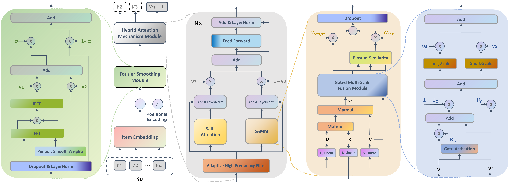
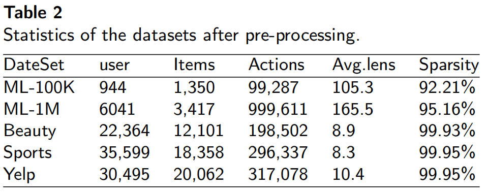

# ASRec: Adaptive Sequential Recommendation with Dynamic and Periodic Preferences Capturing
Official PyTorch Code base for "ASRec: Adaptive Sequential Recommendation with Dynamic and Periodic Preferences Capturing". The code is built on the [RecBole](https://github.com/RUCAIBox/RecBole) library, implemented by [@WLHao0313](https://github.com/WLHao0313).

* The model implementation is at `recbole/model/sequential_recommender/asrec.py`

## Abstract
Sequence recommendation (SR), an important research direction in personalized recommender systems, faces threefold challenges: sequence noise interference, user dynamic and periodic preferences, and excessive smoothing of user characteristics. To address the sequence noise problem, numerous denoising methods have been explored to reduce the noise interference, but existing methods have not considered the dynamic changes in the user's interests. In this paper, we introduce a novel Sequential Recommendation (SR) model, **A**daptive **S**equential **Rec**ommendation with Dynamic and Periodic Preferences Capturing (ASRec), which aims to reduce sequence noise interference through implicit denoising, capture user dynamic and periodic preferences, and reduce feature oversmoothing in a fast and efficient manner. This approach seeks to more accurately reveal the user's true interests and enhance the recommendation effect. In this model, we adjust the denoising intensity and periodic preference capturing ability according to the different characteristics of the dataset through the Fourier smoothing module, so as to minimize the noise interference and efficiently capture the user's periodic preferences. Meanwhile, we design a hybrid attention module that combines and improves the low-pass filtering properties of the self-attention mechanism, which is able to capture the dynamic preferences of users, thus balancing their stable preferences and dynamic preferences. In addition, it is able to reduce the effect of over-smoothing of features, thus better modelling the user's true preferences. We conduct extensive experiments on five real-world datasets. The results show that ASRec significantly outperforms existing state-of-the-art approaches in both efficiency and effectiveness.

<p align="center">
  
</p>


## Using the code:
The code is stable while using Python 3.7.12, PyTorch >= 1.13.1.
- Clone this repository:
```bash
git clone https://github.com/WLHao0313/ASRec
cd ASRec
```
- To install all the dependencies using conda:
```
conda create -n asrec python=3.7.12 -y
conda activate asrec
pip install -r requirements.txt
```

## Datasets
1) ml-100k - [Link](https://recbole.s3-accelerate.amazonaws.com/ProcessedDatasets/MovieLens/ml-100k.zip)
2) ml-1M - [Link](https://recbole.s3-accelerate.amazonaws.com/ProcessedDatasets/MovieLens/ml-1m.zip)
3) amazon-beauty - [Link](https://recbole.s3-accelerate.amazonaws.com/ProcessedDatasets/Amazon_ratings/Amazon_Beauty.zip)
4) amazon-sports-outdoors - [Link](https://recbole.s3-accelerate.amazonaws.com/ProcessedDatasets/Amazon_ratings/Amazon_Sports_and_Outdoors.zip)
5) yelp - [Link](https://recbole.s3-accelerate.amazonaws.com/ProcessedDatasets/Yelp/yelp.zip)

Following is the statistics of the datasets we use:
<p align="center">
  
</p>

## Training time
On ml-1m dataset:
```
python run_ASRec.py --dataset=ml-1m
```
For other datasets, simply replace "ml-1m" with the dataset name (e.g. ml-100k, amazon-beauty, amazon-sports-outdoors, yelp).

## Case Studies
The model ASRec successfully captures users' periodic and dynamic preference displays:
<p align="center">
  
</p>
